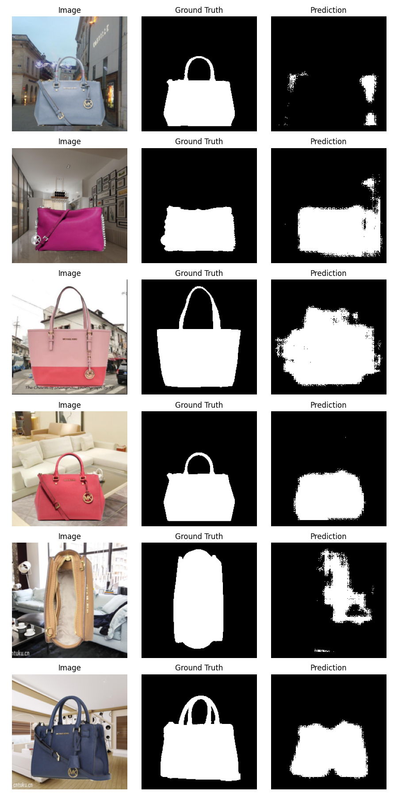
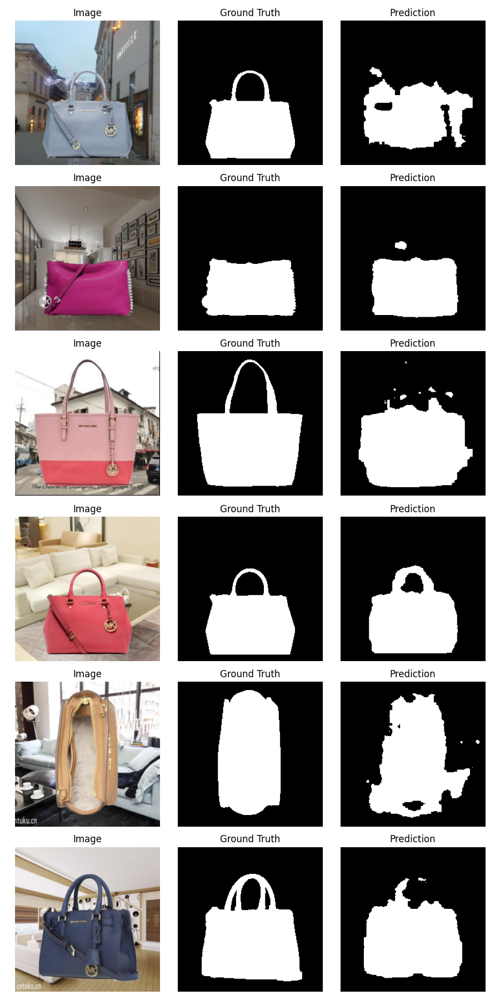
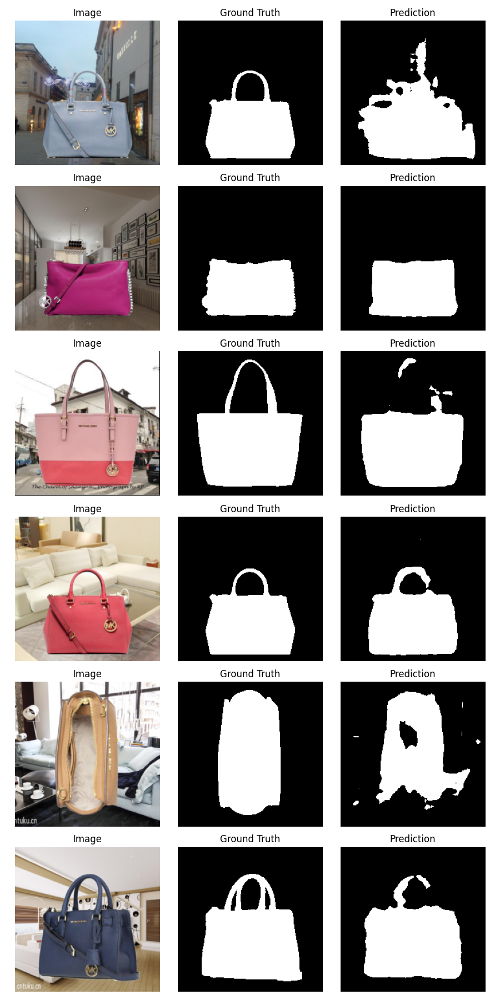

# FCN-Handbag-Segmentation

基于全卷积网络（FCN）的手提包语义分割项目。

## 📁 项目结构

```
FCN_handbag/
├── DataLoader.py          # 数据加载器
├── Model.py               # FCN 模型（支持 32s/16s/8s）
├── Run.py                 # 训练和推理主函数
├── VisualLoss.py          # 训练损失可视化工具
├── train_log.txt          # 训练日志
├── HandBag.zip            # 数据集（包含 train/test）
├── checkpoints/           # 模型权重保存目录
├── vis_output/            # 每 epoch 的预测可视化
└── Figure_1.png           # 损失可视化图
```

## 🎯 项目简介

本项目实现了基于 FCN 的手提包语义分割任务，主要特点：

- **支持三种 FCN 版本**：FCN-32s、FCN-16s、FCN-8s
- **数据处理**：Letterbox 等比缩放、归一化
- **训练可视化**：每 epoch 保存预测结果，便于主观验证
- **断点续训**：支持从指定 checkpoint 继续训练

## 📊 训练结果

### 损失曲线


- 每个pth文件大小约1G，难以上传到Github
- 使用4G显存训练，每个epoch大约1分钟，输入尺寸为224*224，batch_size为4
- Vgg16网络参数数量太大，建议换为其他网络，如ResNet18/50，可能ResNet网络效果比Vgg16好。

### 预测结果示例

| Epoch 1 | Epoch 20 | Epoch 40 | Epoch 60 | Epoch 100 |
|-------|------|--------|------|----------|
|  |  |  |  |  |

## 🚀 使用方法

### 训练模型

编辑 `Run.py`，取消 `run_train` 的注释：

```python
run_train(
    epochs=100,
    lr=0.01,
    train_root=r'F:\datasets\HandBag\train',
    test_root=r'F:\datasets\HandBag\test',
    num_classes=2,            # 两个类别：背景和前景
    loss_txt_path='train_log.txt',
    version='8s',             # FCN版本 FCN8s
    batch_size=4,
    save_interval=5,          # 每隔多少epoch就保存
    resume=None,              # 断点续训: resume='./checkpoints/fcn_8s_60.pth'
    vis_dir='./vis_output/',  # 每个epoch输出结果路径
    device='cuda',
    save_dir='./checkpoints/' # pth保存路径
)
```

运行：
```bash
python Run.py
```

### 推理测试

编辑 `Run.py`，取消 `run_inference` 的注释：

```python
run_inference(
    pth_path='./checkpoints/fcn_8s_final.pth',
    test_root=r'F:\datasets\HandBag\test',
    num_classes=2,
    version='8s',
    device='cuda'
)
```

### 可视化损失

```bash
python VisualLoss.py
```

## 📝 训练日志示例

```
epoch: 1, loss: 1.564681, lr: 0.100000
epoch: 10, loss: 0.337694, lr: 0.100000
epoch: 30, loss: 0.250342, lr: 0.100000
epoch: 60, loss: 0.194016, lr: 0.010000
epoch: 100, loss: 0.162973, lr: 0.001000
```

## 🔧 模型配置

| 参数 | 说明 | 默认值 |
|------|------|--------|
| `version` | FCN 版本 | '8s' |
| `num_classes` | 类别数（含背景） | 2 |
| `batch_size` | 批大小 | 4 |
| `lr` | 初始学习率 | 0.01 |
| `epochs` | 训练轮次 | 100 |
| `save_interval` | 权重保存间隔 | 5 |

## 📁 数据集结构

```
HandBag/
├── train/
│   ├── imgs/        # 训练图像 (.jpg)
│   └── labels/      # 训练标签 (.jpg)
└── test/
    ├── imgs/        # 测试图像 (.jpg)
    └── labels/      # 测试标签 (.jpg)
```

标签格式：黑色(0)为手提包，白色(255)为背景，在代码中将其反转了，变为白色是手提包，黑色是背景。

*如有问题，请提交 Issue！* 😊
