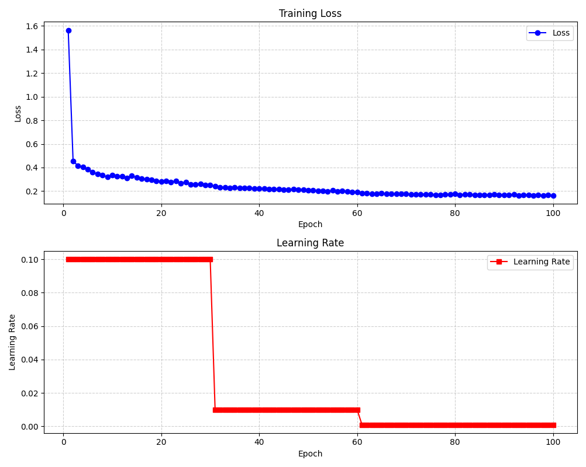
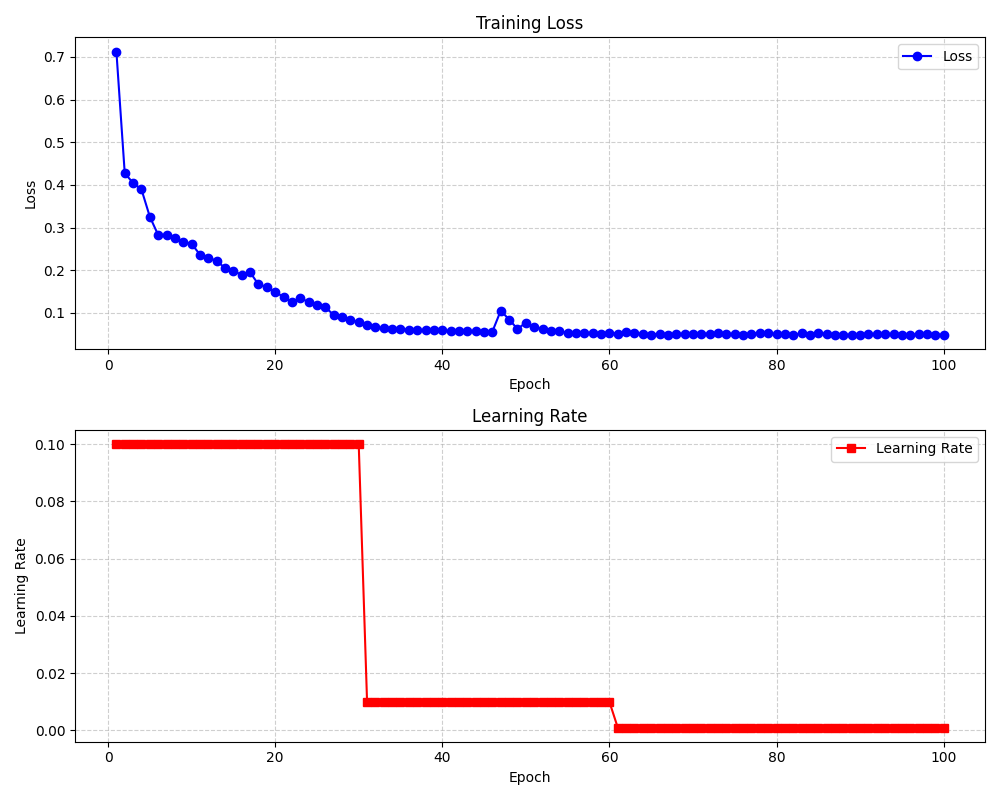
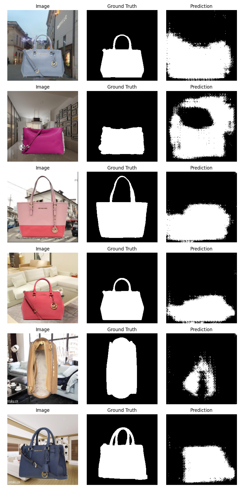
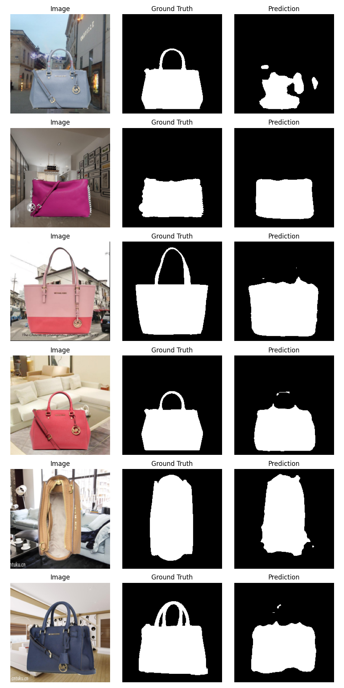
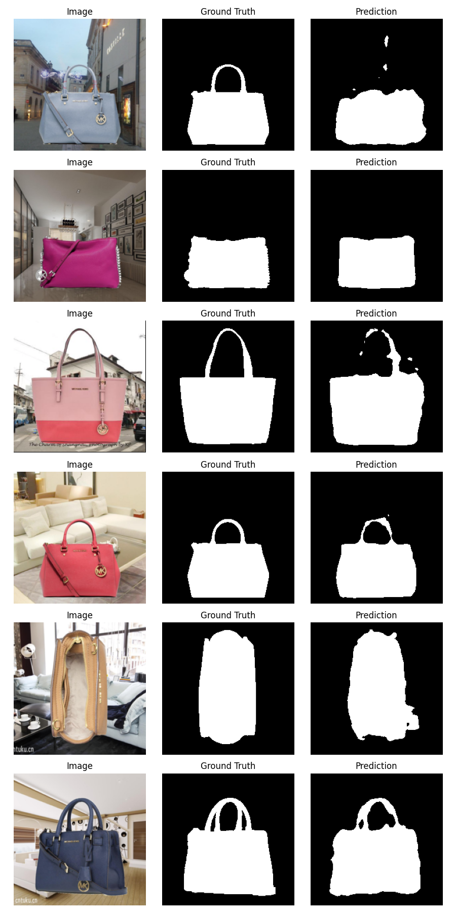
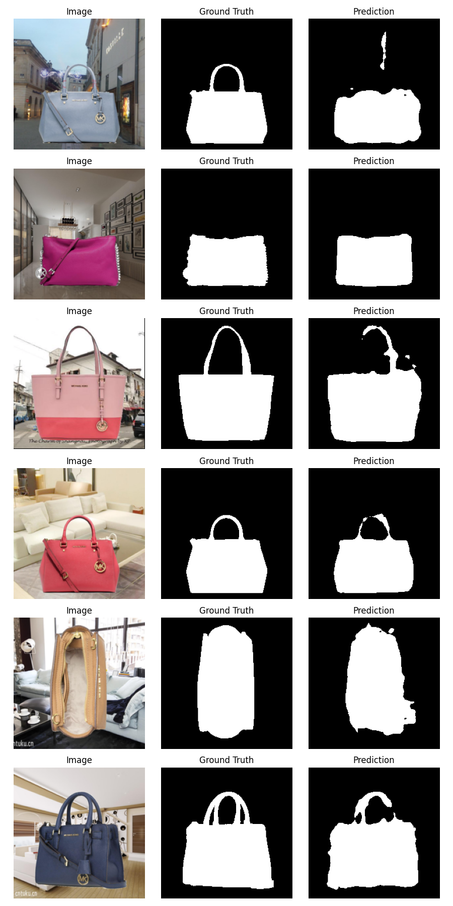
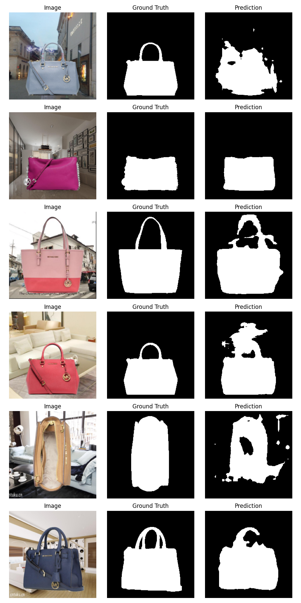
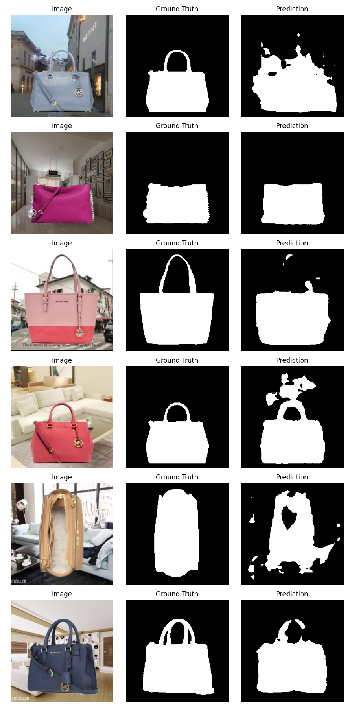

# FCN-Handbag-Segmentation

基于全卷积网络（FCN）的手提包语义分割项目，支持 **VGG16** 和 **ResNet18** 两种骨干网络。

## 📁 项目结构

```
FCN_handbag/
├── DataLoader.py              # 数据加载器
├── FCN_Vgg16.py               # VGG16 骨干的 FCN 模型
├── FCN_ResNet18.py            # ResNet18 骨干的 FCN 模型
├── Run.py                     # 训练和推理主函数
├── VisualLoss.py              # 训练损失可视化工具
├── train_log_fcnvgg16.txt     # VGG16 训练日志
├── train_log_fcnresnet18.txt  # ResNet18 训练日志
├── HandBag.zip                # 数据集（包含 train/test）
├── ckpts_fcnvgg16/            # VGG16 模型权重，pth文件太大，暂不上传
├── ckpts_fcnresnet18/         # ResNet18 模型权重
├── vis_output_fcnresnet18/    # resnet18主干FCN每个 epoch 的预测可视化
├── vis_output_fcnvgg16/       # vgg16主干FCN每个 epoch 的预测可视化
├── Fig_fcnresnet18.png        # resnet18主干FCN损失曲线
└── Fig_fcnvgg16.png           # vgg16主干FCN损失曲线
```

## 🎯 项目简介

本项目实现了基于 FCN 的手提包语义分割任务，支持两种骨干网络：

| 骨干网络 | 优点 | 缺点 | 最终 Loss |
|----------|------|------|-----------|
| **VGG16** | - | 参数多（约1G），训练慢 | 0.163 |
| **ResNet18** | 参数少（约80M），训练快，效果比Vgg16好 | - | **0.049** |

- **支持两种骨干网络**：VGG16、ResNet18
- **支持三种 FCN 版本**：FCN-32s、FCN-16s、FCN-8s
- **数据增强**：Letterbox 等比缩放、归一化
- **训练可视化**：每 epoch 保存预测结果，便于主观验证
- **断点续训**：支持从指定 checkpoint 继续训练

## 📊 训练结果

### 损失曲线-FCN Vgg16



- 每个pth文件大小约1G，难以上传到Github
- 使用4G显存训练，每个epoch大约1分钟，输入尺寸为224*224，batch_size为4
- Vgg16网络参数数量太大，建议换为其他网络，如ResNet18/50

### 损失曲线-FCN ResNet18



- 每个pth文件大小约80M
- 使用4G显存训练，每个epoch大约15秒，输入尺寸为224*224，batch_size为16
- 网络效果要比Vgg16好

### 预测结果示例

每张图像的第一列是原图，第二列是真实分割掩码，第三列是模型预测的分割掩码。

**ResNet18主干**

| Epoch 1 | Epoch 20 | Epoch 40 | Epoch 60 | Epoch 80 | Epoch 100 |
|---------|----------|----------|----------|----------|-----------|
|  |  |  |  |  |  |

**VGG16主干**

| Epoch 1 | Epoch 20 | Epoch 40 | Epoch 60 | Epoch 80 | Epoch 100 |
|---------|----------|----------|----------|----------|-----------|
|  |  |  |  |  |  |


### 训练配置

| 配置项 | ResNet18 | VGG16 |
|--------|----------|-------|
| Batch Size | 16 | 4 |
| 输入尺寸 | 224×224 | 224×224 |
| 训练时长/epoch | ~15s | ~60s |
| 显存占用 | ~1.2GB | ~4GB |
| 模型大小 | ~80MB | ~1GB |

## 🚀 使用方法

### 训练模型

编辑 `Run.py`，取消 `run_train` 的注释：

```python
run_train(
    epochs=100,
    lr=0.01,
    train_root=r'F:\datasets\HandBag\train',
    test_root=r'F:\datasets\HandBag\test',
    num_classes=2,            # 两个类别：背景和前景
    loss_txt_path='train_log.txt',
    version='8s',             # FCN版本 FCN8s
    batch_size=4,
    save_interval=5,          # 每隔多少epoch就保存
    resume=None,              # 断点续训: resume='./checkpoints/fcn_8s_60.pth'
    vis_dir='vis_output_fcnvgg16/',  # 每个epoch输出结果路径
    device='cuda',
    save_dir='ckpts_fcnvgg16/' # pth保存路径
)
```

更改模型主干模型：
前提是需要 `from FCN_Vgg16 import FCN_Vgg16`
```
                ↓ 把这里替换掉即可，例如FCN_Vgg16(Args...)
    model = FCN_ResNet18(num_classes=num_classes, version=version).to(device)
    criterion = nn.CrossEntropyLoss()  # 自动对预测做 softmax
    optimizer = optim.SGD(model.parameters(), lr=lr, momentum=0.9, weight_decay=1e-4)

```

运行：
```bash
python Run.py
```

### 推理测试

编辑 `Run.py`，取消 `run_inference` 的注释：

```python
run_inference(
    pth_path='ckpts_fcnresnet18/fcn_8s_final.pth',
    test_root=r'F:\datasets\HandBag\test',
    num_classes=2,
    version='8s',
    device='cuda'
)
```

### 可视化损失

```bash
python VisualLoss.py
```

## 📝 训练日志示例

**VGG16 (100 epochs):**
```
epoch: 1, loss: 1.564681, lr: 0.100000
epoch: 30, loss: 0.250342, lr: 0.100000
epoch: 60, loss: 0.194016, lr: 0.010000
epoch: 100, loss: 0.162973, lr: 0.001000
```

**ResNet18 (58 epochs):**
```
epoch: 1, loss: 0.712619, lr: 0.100000
epoch: 30, loss: 0.077924, lr: 0.100000
epoch: 60, loss: 0.053584, lr: 0.010000
epoch: 100, loss: 0.048687, lr: 0.001000
```

## 🔧 模型配置

| 参数 | 说明 | 默认值 |
|------|------|--------|
| `version` | FCN 版本 ('32s', '16s', '8s') | '8s' |
| `num_classes` | 类别数（含背景） | 2 |
| `batch_size` | 批大小 | 16 (ResNet) / 4 (VGG) |
| `lr` | 初始学习率 | 0.1 |
| `epochs` | 训练轮次 | 100 |
| `save_interval` | 权重保存间隔 | 5 |

## 📁 数据集结构

```
HandBag/
├── train/
│   ├── imgs/        # 训练图像 (.jpg)
│   └── labels/      # 训练标签 (.jpg)
└── test/
    ├── imgs/        # 测试图像 (.jpg)
    └── labels/      # 测试标签 (.jpg)
```

标签格式：黑色(0)为手提包，白色(255)为背景，在代码中将其反转了，变为白色是手提包，黑色是背景。

*如有问题，请提交 Issue！* 😊
